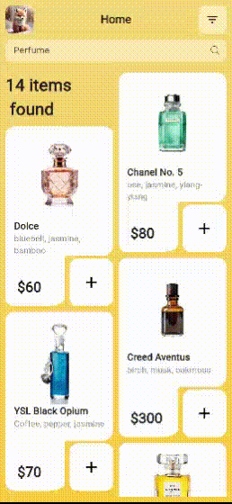

# Flutter Mobile UI Showcase 📱✨

A mobile-only Flutter app created as part of my **showcase projects**.  
This project focuses on delivering beautiful UI with **animations**, **custom shapes**, and clean design patterns.  

## Features ✅

- **Mobile-First App** – Designed specifically for mobile screens.  
- **Hero Animation** – Smooth transition animations between pages.  
- **Custom Shapes & Custom Paint** – Created unique UI elements with custom painting.  
- **Animations** – Combination of implicit and explicit animations for interactive feel.  

## Current Status ⚙️

- This is a **showcase project**, not a production app.  
- Some **UI refinements** (especially in custom-painted sections and alignment) are in progress.  
- The app is fully functional and demonstrates key Flutter concepts for recruiters.  

## Tech Stack 💻

- Flutter  
- Dart  
- Hero Animation  
- Custom Paint  

## Demo Video 🎥

## Notes 📝

This project is primarily for **demonstrating Flutter skills**:  
- Hero transitions  
- Custom painting  
- Mobile-first UI design  

Future improvements will include polishing alignment in custom-painted widgets for small screens.  

